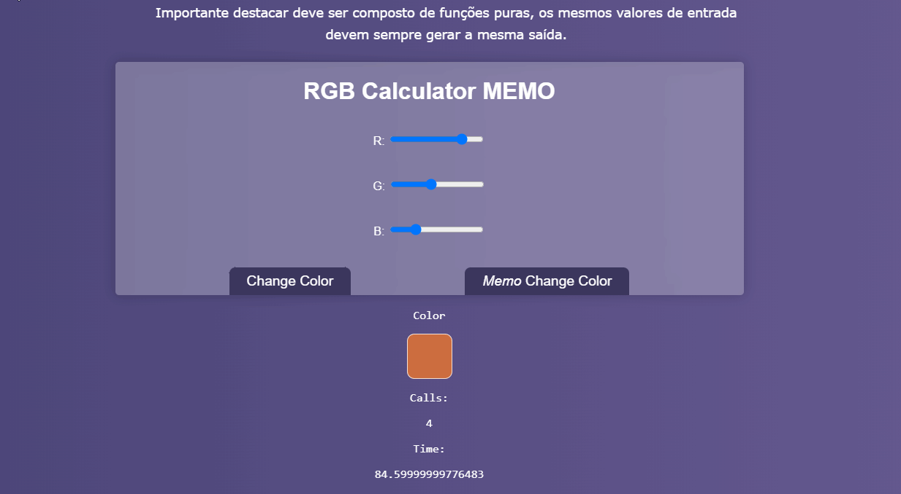

# JS Vanilla Memo



# Inicializando
```
npm install
npm run dev

```

# Referência

 

Programador a Bordo: https://www.youtube.com/watch?v=YEC46W3LPuY


# Conceitos aprendidos
* Memo
* Funções Puras
* High Order Functions
* Estrutura Map
